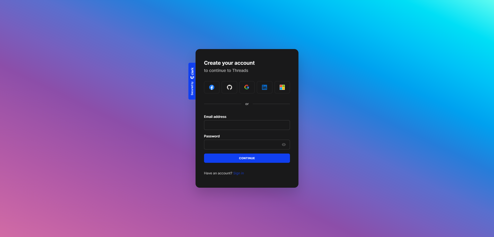

<a name="readme-top"></a>

<p align="center">

</p>
<p align="center">
<!-- Badges -->
  <a href="https://github.com/ladunjexa">
    
  </a>
  <a href="https://github.com/ladunjexa/nextjs13-threads/blob/master/LICENSE">
    
  </a>
  <a href="https://github.com/ladunjexa/nextjs13-threads/graphs/contributors">
    
  </a>
  <a href="">
    
  </a>
  <a href="https://github.com/ladunjexa/nextjs13-threads/network/members">
    
  </a>
  <a href="https://github.com/ladunjexa/nextjs13-threads/stargazers">
    
  </a>
  <a href="https://github.com/ladunjexa/nextjs13-threads/issues/">
    
  </a>
  <a href="https://github.com/ladunjexa/nextjs13-threads/issues/">
    
  </a>
</p>

<h1 align="center">NextJS Threads</h1>

Threads web application, a social media platform that allows users to share their thoughts, with their friends and family. Threads is a full-stack web application built with TypeScript using Next.js 13 with Server Side Rendering. It uses MongoDB as a database, and Clerk as an authentication provider. It also uses UploadThing to upload images to the cloud. The application is styled with Tailwind CSS and Shadcn components.

#### [View Demo](https://nextjs13-threads.vercel.app/)

## Table of Contents

- [Introduction](#star2-introduction)
  - [Folder Structure](#folder-structure)
- [Technologies Used](#space_invader-technologies-used)
- [Features](#mountain_bicyclist-features)
- [Environment Variables](#key-environment-variables)
- [Getting Started](#toolbox-getting-started)
  - [Installation and Run Locally](#gear-installation-and-run-locally)
  - [Getting Started](#beer-getting-started)
  - [Learn More](#learn-more)
  - [Deploy on Vercel](#deploy-on-vercel)
  - [Additional Resources](#additional-resources)
- [Screenshots](#camera-screenshots)
- [Contributing](#wave-contributing)
- [License](#warning-license)
- [Contact](#handshake-contact)

## :star2: Introduction

Threads web application, a social media platform that allows users to share their thoughts, with their friends and family. Threads is a full-stack web application built with TypeScript using Next.js 13 with Server Side Rendering. It uses MongoDB as a database, and Clerk as an authentication provider. It also uses UploadThing to upload images to the cloud. The application is styled with Tailwind CSS and Shadcn components.

### Folder Structure

<b>Threads</b> code folder structure is as follows:

```
nextjs13-threads/
├── app/
├   ├── (auth)/
├   ├   ├── onboarding/
├   ├   ├   └── page.tsx
├   ├   ├── sign-in/[[...sign-in]]/
├   ├   ├   └── page.tsx
├   ├   ├── sign-up/[[...sign-up]]/
├   ├   ├   └── page.tsx
├   ├   └── layout.tsx
├   ├── (root)/
├   ├   ├── activity/
├   ├   ├   └── page.tsx
├   ├   ├── communities/
├   ├   ├   ├── [id]/
├   ├   ├   ├   └── page.tsx
├   ├   ├   └── page.tsx
├   ├   ├── create-thread/
├   ├   ├   └── page.tsx
├   ├   ├── edit-thread/[id]/
├   ├   ├   └── page.tsx
├   ├   ├── explore/
├   ├   ├   └── page.tsx
├   ├   ├── profile/
├   ├   ├   ├── [id]/
├   ├   ├   ├   └── page.tsx
├   ├   ├   └── edit/
├   ├   ├       └── page.tsx
├   ├   ├── search/
├   ├   ├   └── page.tsx
├   ├   ├── thread/
├   ├   ├   ├── [id]/
├   ├   ├   ├   └── page.tsx
├   ├   ├   └── reactions/[id]/
├   ├   ├       └── page.tsx
├   ├   ├── layout.tsx
├   ├   └── page.tsx
├   ├── api/
├   ├   ├── uploadthing/
├   ├   ├   └── page.tsx
├   ├   └── webhook/clerk/
├   ├          └── route.tsx
├   ├── favicon.ico
├   └── globals.css
├── components/
├   ├── atoms/
├   ├   ├── CommunityCard.tsx
├   ├   ├── ThreadCard.tsx
├   ├   └── UserCard.tsx
├   ├── cards/
├   ├   ├── EditThread.tsx
├   ├   ├── FollowUser.tsx
├   ├   └── ReactThread.tsx
├   ├── forms/
├   ├   ├── AccountProfile.tsx
├   ├   ├── Comment.tsx
├   ├   ├── DeleteThread.tsx
├   ├   └── PostThread.tsx
├   ├── shared/
├   ├   ├── Bottombar.tsx
├   ├   ├── Topbar.tsx
├   ├   ├── LeftSidebar.tsx
├   ├   ├── RightSidebar.tsx
├   ├   ├── Pagination.tsx
├   ├   ├── Searchbar.tsx
├   ├   ├── ProfileHeader.tsx
├   ├   └── ThreadsTab.tsx
├   └── ui/ (generated by shadcn/ui)
├       ├── button.tsx
├       ├── form.tsx
├       ├── input.tsx
├       ├── label.tsx
├       ├── tabs.tsx
├       └── textarea.tsx
├── constants/
├   └── index.js
├── lib/
├   ├── actions/
├   ├   ├── community.actions.ts
├   ├   ├── thread.actions.ts
├   ├   └── user.actions.ts
├   ├── models/
├   ├   ├── community.model.ts
├   ├   ├── thread.model.ts
├   ├   └── user.model.ts
├   ├── validations/
├   ├   ├── thread.ts
├   ├   └── user.ts
├   ├── mongoose.ts
├   ├── uploadthing.ts
├   └── utils.ts
├── public/
├   ├── assets/
├   ├   └── [[...]].svg
├   ├── next.svg
├   └── vercel.svg
├── components.json
├── middleware.ts
├── next.config.ts
├── package.json
├── postcss.config.js
├── tailwind.config.js
├── tailwind.config.js (meaningless)
└── tsconfig.ts
```

Now let's dive into each folder and see what it contains.

#### app

`(auth)/` - `(root)/` - `(api)/`

In the app directory, nested folders are normally mapped to URL paths. However, you can mark a folder as a Route Group to prevent the folder from being included in the route's URL path.

This allows you to organize your route segments and project files into logical groups without affecting the URL path structure.

For example,


#### components

`atoms/` - `cards/` - `forms/` - `shared/` - `ui/`

The components directory contains all the components used in the application. The components are grouped into atoms, cards, forms, shared and ui.
the `ui` folder generated by `shadcn/ui` package and contains all the required shadcn components that used in the application.

#### constants

`index.js`

This is a JavaScript code contains all the constants used in the application, specifically the Sidebar Navigation (`sidebarLinks`), Profile Tabs (`profileTabs`) and Community Tabs (`communityTabs`) constants.

#### lib

`actions/` - `models/` - `validations/` - `mongoose.ts` - `uploadthing.ts` - `utils.ts`

The **lib** folder holds crucial components for _Threads App_:
**actions**: Manage actions for Community, Thread, and User entities using Mongoose for database interaction.
**models**: Define mongoose schemas for Community, Thread, and User entities.
**validations**: Provide validation schemas with Zod for Thread and User data.
**mongoose.ts**: Establishes and manages MongoDB connections for the application.
**uploadthing.ts**: Offers a React utility for simplified file uploads to UploadThing.
**utils.ts**: Contains various reusable utility functions.

#### public

`assets/` - `next.svg` - `vercel.svg`

The public directory contains the media used in the application. The assets folder contains all the images used in the application.

<p align="right">(<a href="#readme-top">back to top</a>)</p>

## :space_invader: Technologies Used

Threads web application is built using the following technologies:

- [TypeScript](https://www.typescriptlang.org/): TypeScript is a typed superset of JavaScript that compiles to plain JavaScript.
- [Next.js](https://nextjs.org/): Next.js is a React framework for building server-side rendered and statically generated web applications.
- [Tailwind CSS](https://tailwindcss.com/): Tailwind CSS is a utility-first CSS framework for rapidly building custom user interfaces.
- [Shadcn](https://shadcn.com/): Shadcn is a collection of Tailwind CSS components.
- [Clerk](https://clerk.dev/): Clerk is a developer-first authentication API that handles all the logic for user sign up, sign in, and more.
- [UploadThing](https://uploadthingy.com/): UploadThing is a simple, fast, and reliable file uploader for your website.
- [MongoDB](https://www.mongodb.com/): MongoDB is a general purpose, document-based, distributed database built for modern application developers and for the cloud era.
- [Mongoose](https://mongoosejs.com/): Mongoose is a MongoDB object modeling tool designed to work in an asynchronous environment.
- [Zod](https://zod.dev/): Zod is a TypeScript-first schema declaration and validation library.
- [svix](https://svix.com/): Svix is a webhook proxy that allows you to receive webhooks locally.
- [Vercel](https://vercel.com/): Vercel is a cloud platform for frontend developers, providing the frameworks, workflows, and infrastructure to build a faster, more personalized Web.

[](https://skillicons.dev)

<p align="right">(<a href="#readme-top">back to top</a>)</p>

## :mountain_bicyclist: Features

Threads web application comes with the following features:

- [x] CRUD Threads
- [x] CRUD Communities
- [x] CRU Profiles
- [x] Like Threads
- [x] Multi-level Comment Threads
- [x] Follow Profiles
- [x] Search Profiles and Communities
- [x] Activity Feed (Likes, Comments, Follows)
- [x] Explore Feed (Threads of Followed Profiles)
- [x] Profile Tabs (Threads, Followers, Following)
- [x] Community Tabs (Threads, Members, Requests)
- [x] Suggested Communities and Profiles
- [x] Thread Likes Page (Profiles that liked a Thread)

and much more...

In terms of technical features, Threads web application comes with the following features:

- [x] TypeScripted Codebase with Next.js
- [x] Authentication with Clerk
- [x] User Management with Clerk
- [x] Organization Management with Clerk
- [x] File Upload with UploadThing
- [x] Server Side Rendering with Next.js
- [x] MongoDB Database
- [x] Mongoose ODM
- [x] Zod Validation
- [x] Shadcn Components
- [x] Tailwind CSS
- [x] Svix Webhook Proxy
- [x] Vercel Deployment

and much more..

<p align="right">(<a href="#readme-top">back to top</a>)</p>

## :key: Environment Variables

Threads web application uses Clerk, UploadThing and MongoDB to handle authentication and user management, file upload and database. Therefore, you need to create accounts on Clerk, UploadThing and MongoDB and get your API keys and add them to the environment variables in the .env file.

To run this project, you will need to add the following environment variables to your .env file

```env
NEXT_PUBLIC_CLERK_PUBLISHABLE_KEY=<CLERK_PUBLISHABLE_KEY>
CLERK_SECRET_KEY=<CLERK_SECRET_KEY>
NEXT_CLERK_WEBHOOK_SECRET=<CLERK_WEBHOOK_SECRET>

NEXT_PUBLIC_CLERK_SIGN_IN_URL=<CLERK_SIGN_IN_URL>
NEXT_PUBLIC_CLERK_SIGN_UP_URL=<CLERK_SIGN_UP_URL>
NEXT_PUBLIC_CLERK_AFTER_SIGN_IN_URL=<CLERK_AFTER_SIGN_IN_URL>
NEXT_PUBLIC_CLERK_AFTER_SIGN_UP_URL=<CLERK_AFTER_SIGN_UP_URL>

MONGODB_URL=<MONGODB_URL>
UPLOADTHING_SECRET=<UPLOADTHING_SECRET>
UPLOADTHING_APP_ID=<UPLOADTHING_APP_ID>

```

<p align="right">(<a href="#readme-top">back to top</a>)</p>

## :toolbox: Getting Started

<!-- Installation -->

### :gear: Installation and Run Locally

#### Step 0:

Note :bangbang: the application uses Clerk for Authentication and User Management, therefore, you need to create Clerk account [here](https://clerk.dev/) and sets the `CLERK_PUBLISHABLE_KEY` and `CLERK_SECRET_KEY` environment variables in `.env` file. Also, the different URLs for the Clerk sign-in, sign-up, after sign-in and after sign-up pages.

Note :bangbang: the application uses a MongoDB database, therefore, you need to create a database and connect it to the application, for this, change the `MONGODB_URL` environment variable in `.env` file located in `server` folder.

Note :bangbang: the application uses a UploadThing Cloud, therefore, you need to create UploadThing account [here](https://uploadthing.com/) and sets the `UPLOADTHING_SECRET` and `UPLOADTHING_APP_ID` environment variables in `.env` file.

After following all the instructions above, we'll want to create a new webhook on Clerk. To do this, go to the [Clerk Dashboard](https://dashboard.clerk.dev/), click on the "Webhooks" tab, and then click "Add Endpoint". For the Endpoint URL, enter `http://<PASTE-YOUR-LINK-HERE>/api/webhook/clerk`. For the evetnts, select the "organization", "organizationDomain", "organizationInvitation" and "organizationMembership". Then click "Create" to create the webhook. get the signing secret and set it as `CLERK_WEBHOOK_SECRET` environment variable in `.env` file.

#### Step 1:

Download or clone this repo by using the link below:

```bash
 https://github.com/ladunjexa/nextjs13-threads.git
```

#### Step 2:

**Threads** using NPM (Node Package Manager), therefore, make sure that Node.js is installed by execute the following command in consle

```bash
  node -v
```

#### Step 3:

Go to root folder and execute the following command in console to get nodemon the required packages:

```bash
npm install
```

#### Step 4:

Go to root folder and execute the following command in console to start the application locally:

```bash
npm run dev
```

### :beer: Getting Started

This is a [Next.js](https://nextjs.org/) project bootstrapped with [`create-next-app`](https://github.com/vercel/next.js/tree/canary/packages/create-next-app).

First, run the development server:

```bash
npm run dev
# or
yarn dev
# or
pnpm dev
```

Open [http://localhost:3000](http://localhost:3000) with your browser to see the result.

You can start editing the page by modifying `app/page.tsx`. The page auto-updates as you edit the file.

This project uses [`next/font`](https://nextjs.org/docs/basic-features/font-optimization) to automatically optimize and load Inter, a custom Google Font.

### Learn More

To learn more about Next.js, take a look at the following resources:

- [Next.js Documentation](https://nextjs.org/docs) - learn about Next.js features and API.
- [Learn Next.js](https://nextjs.org/learn) - an interactive Next.js tutorial.

You can check out [the Next.js GitHub repository](https://github.com/vercel/next.js/) - your feedback and contributions are welcome!

### Deploy on Vercel

The easiest way to deploy your Next.js app is to use the [Vercel Platform](https://vercel.com/new?utm_medium=default-template&filter=next.js&utm_source=create-next-app&utm_campaign=create-next-app-readme) from the creators of Next.js.

Check out our [Next.js deployment documentation](https://nextjs.org/docs/deployment) for more details.

### Additional Resources

For additional resources on working with Clerk, MongoDB and Shadcn, refer to the official documentation.

- [Clerk](https://docs.clerk.dev/)
- [MongoDB](https://docs.mongodb.com/)
- [Shadcn](https://ui.shadcn.com/docs)

<p align="right">(<a href="#readme-top">back to top</a>)</p>

## :camera: Screenshots
### Sign In

### Sign Up

### Onboarding

### Home

### Explore

### Search

### Activity

### Create Thread

### Communities

### My Profile


### Edit Profile

### User Profile

### Create Organization

### Community Profile

### Thread Page

### Thread Likes Page


## :wave: Contributing

<a href="https://github.com/ladunjexa/Rainblur-Portfolio-Showcase/graphs/contributors">
  
</a>

Contributions are always welcome!

See [`contributing.md`](https://contributing.md/) for ways to get started.

Contributions are what make the open source community such an amazing place to learn, inspire, and create. Any contributions you make are **greatly appreciated**.

If you have a suggestion that would make this better, please fork the repo and create a pull request. You can also simply open an issue with the tag "enhancement".
Don't forget to give the project a star! Thanks again!

1. Fork the Project
2. Create your Feature Branch (`git checkout -b feature/AmazingFeature`)
3. Commit your Changes (`git commit -m 'Add some AmazingFeature'`)
4. Push to the Branch (`git push origin feature/AmazingFeature`)
5. Open a Pull Request

<p align="right">(<a href="#readme-top">back to top</a>)</p>

## :warning: License

_Threads_ web application is open source and distributed under the [MIT License](LICENSE).

<p align="right">(<a href="#readme-top">back to top</a>)</p>

## :handshake: Contact

If you want to contact me, you can reach me at [@ladunjexa](https://t.me/ladunjexa).

<p align="right">(<a href="#readme-top">back to top</a>)</p>
